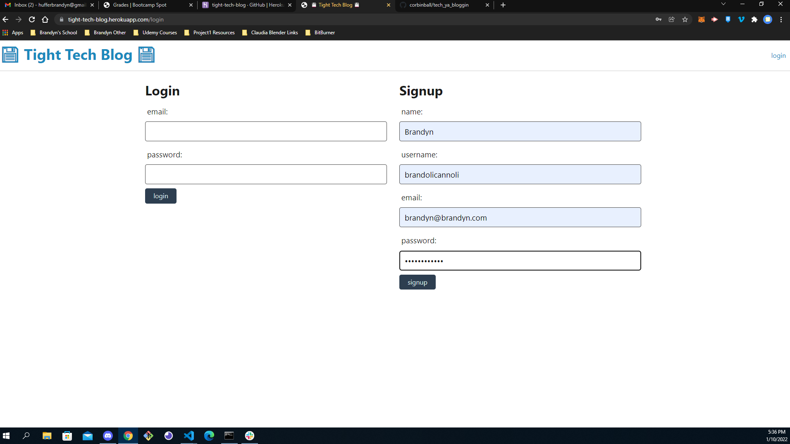
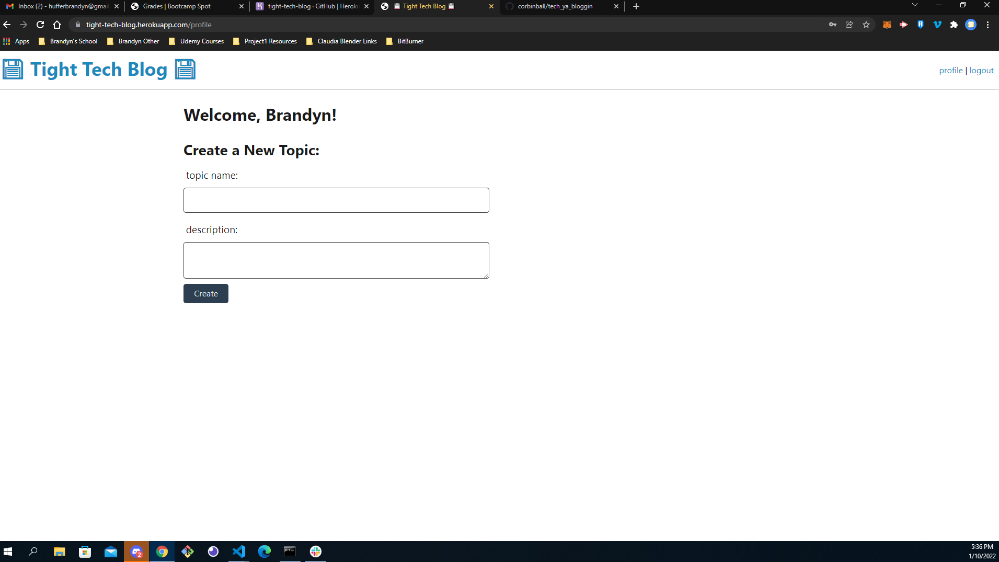
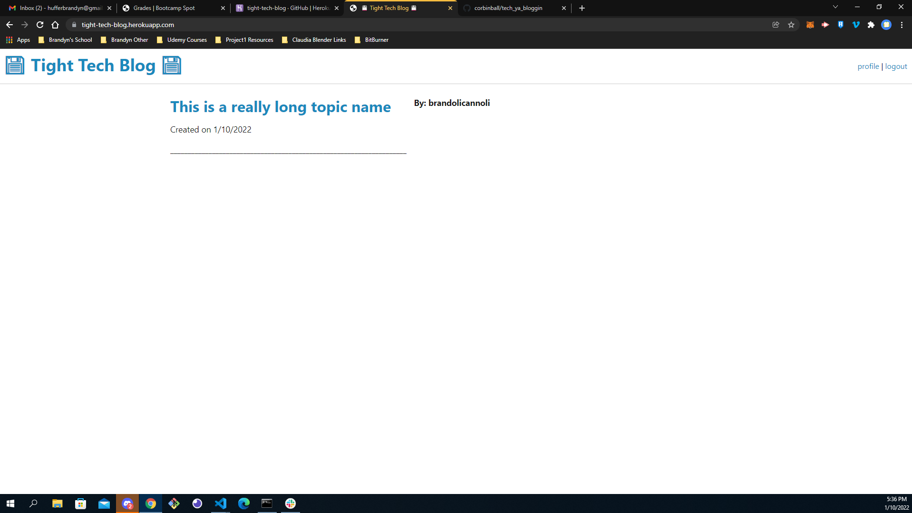
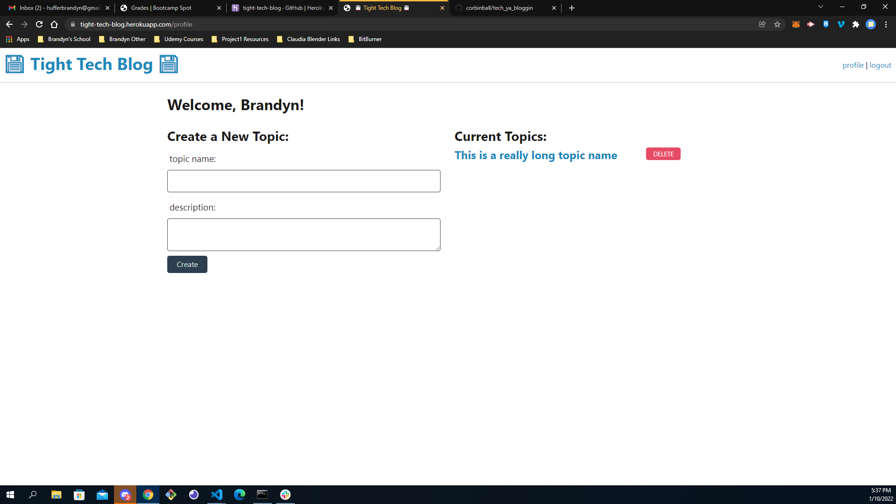

# TightTechBlog

## Table-of-Contents
  - [Table-of-Contents](#table-of-contents)
  - [Description](#description)
  - [App](#app)
  - [Screenshots](#screenshots)
  - [Questions](#questions)
  - [Credits](#credits)
  - [License](#license)

## Description

This is a simple tech blog where users can create/login to a profile as well as create and delete topics.

## App

- App Demo: [Click here](https://tight-tech-blog.herokuapp.com/)

## Screenshots

## Questions
- Github: [Click here](https://github.com/brandynh)
- E-mail: [Click here](hufferbrandyn@gmail.com)

    
## Contributors
Brandyn Huffer

## Credits

* [Sequalize (Models)](https://sequelize.org/v5/class/lib/model.js~Model.html#static-method-belongsTo)
* [Sqeualize (Associations)](https://sequelize.org/v5/class/lib/associations/base.js~Association.html)
* Miniproject template
* Week 14 activities

## License

